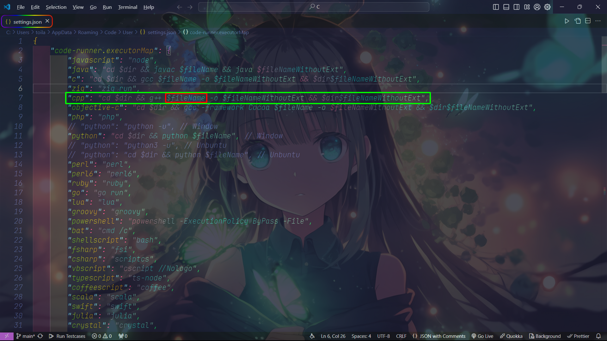
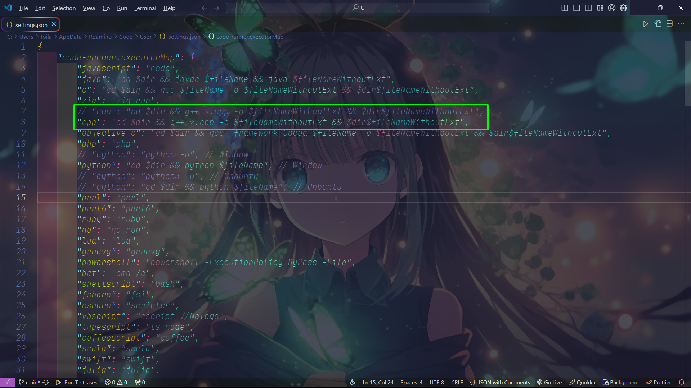
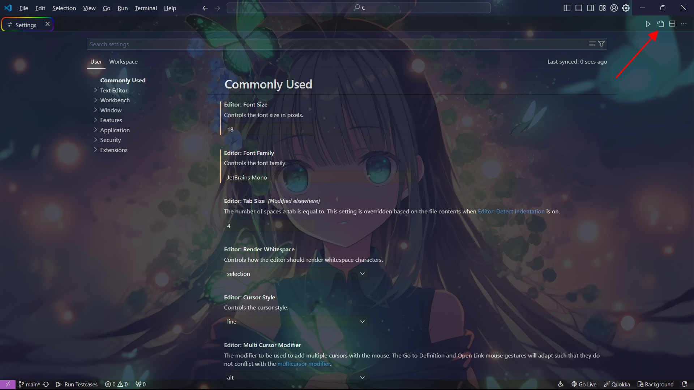

# Tổng hợp của C++

|  |
|----------|

## Giới thiệu về Repository

Tổng hợp các lý thuyết và bài tập và những mã nguồn hay của các khóa học free trên mạng như 28Tech, How Kteam, CodeLearn, ...

## Số lưu ý khi _'git clone code'_

### 1. Thư viện

Vì viết bằng `Text editor: Visual Studio Code` [(vscode)](https://code.visualstudio.com/) + môi trường [MSYS2](https://www.msys2.org/) hoặc [MinGW](https://sourceforge.net/projects/mingw/) cho `C++` nên có thư viện tổng hợp:

```
#include<bits/stdc++.h>
```

thì có nhiều IDE khác không có, nên các bạn tự sửa phần thư viện nha.

### 2. Cấu trúc folder code

Khi clone về sẽ có vài folder có 2 file .cpp và 1 file .h.

#### _Hiểu về 3 file_

Đây là cấu trúc trong lặp trình hướng đối tượng `Object-oriented programming` viết tắt là **OOP**. File `.h` còn gọi là file **header** chỉ thường dùng chỉ đề khai báo chứ không dùng để viết xử lý code bên trong. File `.cpp` khác với file `main.cpp` và có tên giống y chang file **header** vì file này dùng để viết xử lý code bên trong. Cuối cùng là file `main.cpp` chỉ có phần _main_ để chạy test.

#### _Cách chạy code_

**Mô tả vấn đề**

`Vscode` sẽ không chạy được hai file `.cpp` cùng một lúc là do cách viết lệnh gọi file `main` thực thi chương trình. Thì tôi dùng extension [code runner](https://marketplace.visualstudio.com/items?itemName=formulahendry.code-runner) để giúp chạy code nên sẽ bị vấn đề này (nên các bạn tự tay viết lệnh thực thi thì cũng có thể tham khảo).

**Cách khắc phục**

*Lưu ý:* `$fileName` _(file đơn)_ và `*.cpp` _(file tách)_

**Lần đầu fix:**

_Bước 1:_ Vào settings của extension

Cách 1: Vào nhấn vào `Extensions` (ctrl + shift + x) như vị trí số 1 trong ảnh >> Tìm `code runner` >> Chọn `bánh răng` như vị trí số 2 trong ảnh >> Chọn `settings` như vị trí số 3 trong ảnh.


Cách 2: Nhấn vào bánh răng có tên `Manage` (ctrl + ,) gần `accounts` như vị trí số 1 trong ảnh >> Chọn `settings` như vị trí số 2 trong ảnh >> Chọn vào extension `code runner`.


_Bước 2:_ Tìm `Code-runner: Executor Map` >> nhấn vào `Edit in setting.json`.


_Bước 3:_ Hiện ra kiểu dữ liệu `JSON (JavaScript Object Notation)`

Với mặc định thì C++ sẽ như này:

```
"cpp": "cd $dir && g++ $fileName -o $fileNameWithoutExt && $dir$fileNameWithoutExt",
```



Và bạn chỉ cần sửa đoạn code thành như này:

```
"cpp": "cd $dir && g++ *.cpp -o $fileNameWithoutExt && $dir$fileNameWithoutExt",
```


Hoặc bạn có thể để như này chỉ cần comment lại cái không cần dùng bằng phím tắt `ctrl + /`.



**Lần sau fix:**

Bước 1: Nhấn vào bánh răng có tên `Manage` (ctrl + ,) gần `accounts` như vị trí số 1 trong ảnh


Bước 2: Chọn file `setting.json`



Bước 3: Hiện ra kiểu dữ liệu `JSON` thì bạn chỉ cần sửa lại như bước 3 hoặc 4 hoặc 5.

Bây giờ có thể chạy bình thường. Nếu không hiểu có thể vào link này lướt xuống Visual studio code [(Hướng dẫn)](https://blog.luyencode.net/cach-tach-code-c-thanh-file-h-va-cpp/)

### 3. Cấu trúc file code

Trong bài có sử dụng **preprocessor directives** (hướng dẫn trình biên dịch)
Trong bài sài nhiều nhất là `#if` và `#endif` là 2 thứ luôn đi chung với nhau.

```
#if n   Nếu n là 1 thì code chạy
        Nếu n là 0 thì code không thể chạy
```

Và `#endif` có thể đi cùng với nhiều **preprocessor directives** khác nữa